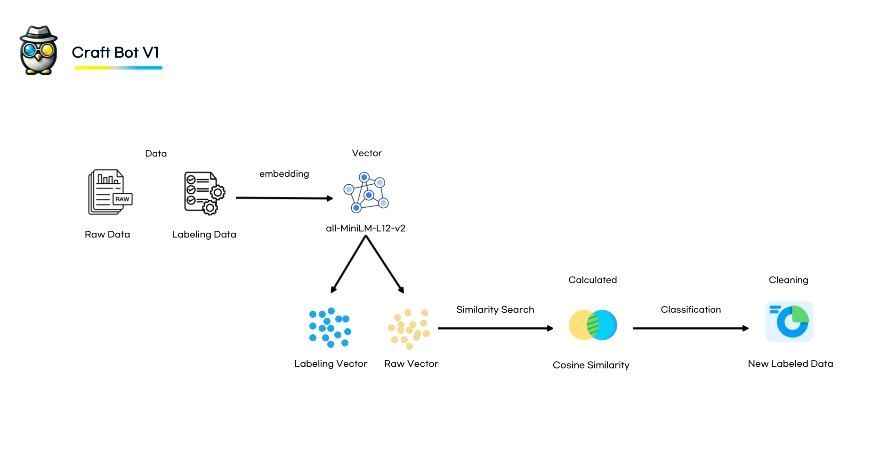

## CraftBot

### Point

embeddings = SentenceTransformer('model')
 
 
--> Insert any embedding model

**My recommendation is..heh**
- all-MiniLM-L6-v2
  - feature: Work it harder, make it better. Do it faster
  - [link](https://huggingface.co/sentence-transformers/all-MiniLM-L6-v2)
- all-MiniLM-L12-v2
  - feature: Work it harder, make it better... Do it slower
  - [link](https://huggingface.co/sentence-transformers/all-MiniLM-L12-v2)
- text-embedding-3-small
  - feature: If you’re swimming in cash, go ahead and use this!
             ... It's got more horsepower than a racecar on rocket fuel!
  - [link](https://platform.openai.com/docs/guides/embeddings/faq)

### Process

